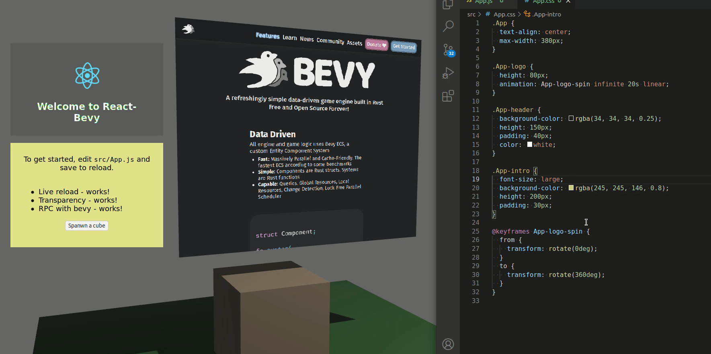

# bevy_webview WIP &emsp; [![Build Status]][actions] [![Latest Version]][crates.io] [![Docs Version]][docs]

[build status]: https://img.shields.io/github/workflow/status/blaind/bevy_webview/test
[actions]: https://github.com/blaind/bevy_webview/actions?query=branch%3Amain
[latest version]: https://img.shields.io/crates/v/bevy_webview.svg
[crates.io]: https://crates.io/crates/bevy_webview
[docs version]: https://docs.rs/bevy_webview/badge.svg
[docs]: https://docs.rs/bevy_webview

Rapidly iterate and build [Bevy](https://bevyengine.org/) UI's with existing web-based technologies

**It is currently very early days of this plugin, and many things are broken (e.g. keyboard input, mouse interaction except for primary button)**

Supported platforms: Linux. Windows [being evaluated](https://github.com/blaind/bevy_webview/issues/7), Mac probably doable ([pull requests welcome, #6](https://github.com/blaind/bevy_webview/issues/6)). Android & IOS are currently unchartered territory.

The plugin uses platform-native webviews ([webkitgtk](https://webkitgtk.org/) on Linux, will use [WebView2](https://developer.microsoft.com/en-us/microsoft-edge/webview2/) on Windows). Core traits are exposed for integrating other webview engines.

## Docs

- [Bevy Webview Book](https://blaind.github.io/bevy_webview_book/)
- [Official Examples](https://github.com/blaind/bevy_webview/tree/latest/examples)

## License

Licensed under either of

- <a href="LICENSE-APACHE">Apache License, Version 2.0</a> or
- <a href="LICENSE-MIT">MIT license</a>

at your option.

### Contribution

Unless you explicitly state otherwise, any contribution intentionally submitted
for inclusion in the software by you, as defined in the Apache-2.0 license, shall be dual licensed as above, without any additional terms or conditions.

### Acknowledgement

Huge thanks to the authors and contributors of [tauri-apps/wry](https://github.com/tauri-apps/wry) for their groundbreaking work upon which this crate is not only based, but also leans heavily upon.
